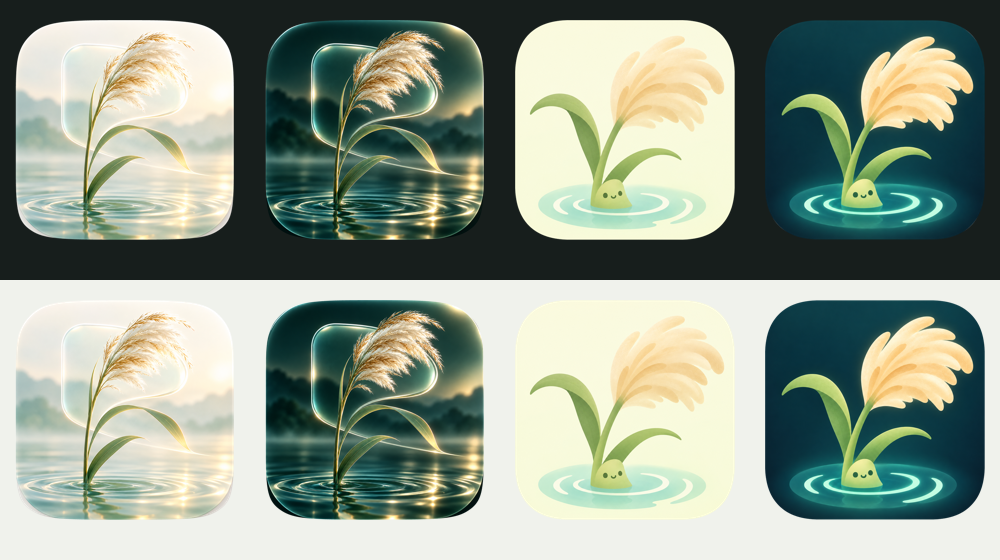
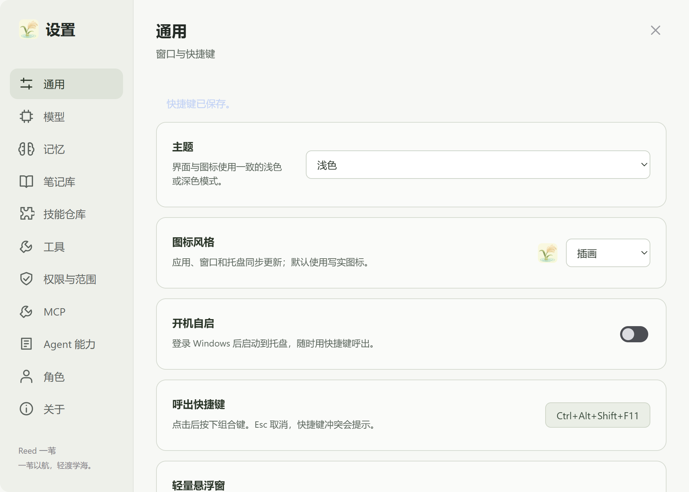

# Reed 一苇

<p align="center">
  
</p>

<p align="center"><strong>一苇以航，轻渡学海。</strong></p>

Reed 是一款面向学习与日常工作的独立 Windows 桌面 Agent。它以快捷键唤出的轻量窗口承载对话，把角色、学习流程、长期记忆和 Obsidian 笔记连接起来，让提问、练习与复习能够接续进行。

应用使用 Tauri、WebView2 和 PI Agent SDK 构建。运行无需安装 PI-Desktop，也无需安装其插件。当前版本为源码与 Windows 便携构建阶段。

## 主要能力

| 能力 | 说明 |
| --- | --- |
| 轻量桌面窗口 | 无系统标题栏、圆角、托盘驻留、全局快捷键；主窗与设置窗分别记住大小和位置 |
| 模型配置 | OpenAI / Anthropic 兼容接口；模型发现、上下文上限、推理协议与视觉能力可编辑 |
| 对话与附件 | Markdown、表格、图片粘贴与预览、本地文档链接；回复时发送默认排队，可将队列项转为引导 |
| 上下文与速度 | 上下文占用圆环、自动和手动压缩、模型与思考档位展示；接口返回 token 用量时显示 tok/s |
| 角色与技能 | 内置 Agent、Planner；角色说明注入系统提示词，可绑定独立技能文件并设置必须使用 |
| 学习与记忆 | 学习目标、偏好、概念、误解与复习记录；长期记忆、知识笔记和历史片段召回 |
| Obsidian 笔记库 | 从 Markdown 笔记中查找相关段落，引用原文件和行号，并提醒复习 |
| 工具与扩展 | 文件工具、独立浏览器、当前时间、Tavily 搜索与正文提取；MCP 按需发现和调用 |
| 权限与审批 | 工作区写入边界、自定义只读目录、完全文件权限；自动审批 / 手动确认 |
| 外观 | 两套原画图标，支持浅色、深色和跟随系统；启动首屏展示 Reed 一苇 |

## 外观

两套原画图标分别提供浅色与深色版本，默认使用写实套。圆角外部为透明区域。



<details>
<summary>通用设置预览</summary>



</details>

## 开始使用

1. 从源码构建便携包，运行其中的 `Reed.exe`。保留 `agent/` 和 `runtime/` 文件夹与程序在一起。
2. 打开设置 → 模型，选择提供商或自定义接口，填写 Base URL、API Key，获取模型列表。
3. 编辑模型，确认上下文上限、推理能力与视觉支持。接口没有返回的能力需要手动补充；发送图片前请启用支持视觉。
4. 在输入区点击 **Model**，选择模型、思考档位并确认；点击 **Role** 选择角色。
5. 可选：设置项目目录、连接 Obsidian Vault、导入技能、配置 Tavily 或 MCP。

默认思考档位为 `off / low / medium / high / xhigh`，默认选择 `off`。这些默认选项不代表服务器声明支持全部档位，实际行为取决于模型服务及其推理协议。

更新时先通过托盘退出旧版，再启动新版。用户配置与聊天保存在程序目录之外，替换便携包不会重置配置。

## 学习流程与角色

角色负责回答原则，技能负责具体步骤。角色编辑中可绑定技能并开启“必须使用”。技能正文保持为独立 `SKILL.md`，便于编辑、更新和复用。

内置三个流程：

- **教学**：确认学习目标和基础 → 讲解与示例 → 理解检查 → 总结与记录。
- **练习生成**：确定考点与难度 → 生成练习 → 收集作答 → 反馈与错因 → 后续练习。
- **间隔复习**：找出待复习概念 → 先回忆再揭示 → 判断薄弱点 → 更新记录 → 安排下一次复习。

按需绑定只把名称和说明提供给 Agent，相关任务再读取正文。必须使用的绑定会在匹配流程开始前由程序加载正文，技能停用或读取失败会阻止该流程。自定义流程可用 `/skill 技能名` 明确启动；不会每轮加载全部正文。角色指令进入系统提示词，Planner 的修改工具由程序禁用；模型本身的回答仍需要结合实际输出检查。

## 数据与权限

- 配置存储在 `%APPDATA%\dev.rynorca.summon\user-config.json`。沿用旧标识是为了兼容升级；提供商、加密凭据、角色、技能、笔记库、MCP 与桌面偏好集中保存。
- API Key 在 Windows 上使用当前用户的 DPAPI 加密。加密配置不能直接作为跨账户迁移凭据使用。
- 会话、记忆、学习事件、附件和窗口状态保存在独立数据文件中。笔记库索引读取 Vault 原文件，不修改原笔记。
- 默认允许读取其他位置的文件，写入限制在当前工作区；自定义只读目录禁止修改。只有完全文件权限可解除这些写入限制。
- 未隔离的 bash / PowerShell 已关闭。文件范围限制不是操作系统进程沙盒；外部 MCP 进程和调用要求完全文件权限，并遵循审批设置。
- 模型请求会把对应对话、附件以及召回内容发送给所选服务；Tavily 和远程 MCP 请求会访问配置的服务。服务费用及数据处理规则由各提供商决定。

## 从源码构建

当前桌面实现主要支持 Windows。准备：

- Node.js **22.19 或更高版本**、npm；
- Rust stable；
- Visual Studio C++ 构建工具及 Windows SDK；
- Microsoft Edge WebView2 Runtime。

在仓库根目录运行 PowerShell：

```powershell
npm ci --prefix desktop/agent
./desktop/tools/package-portable.ps1 -Output ./dist/Reed-portable
```

输出目录包含 `Reed.exe`、内置 Node 运行时和 Agent 依赖。脚本不会覆盖已有输出目录，会为新构建添加时间后缀。

图标的运行资源已经包含在源码中。需要从原画重新制作透明图标时，安装 Pillow 后运行：

```powershell
python desktop/tools/extract-icons.py
./desktop/tools/generate-icon.ps1
```

透明蒙版仅改变边缘 alpha，保留圆角块内原画；PNG 和多尺寸 ICO 供窗口、托盘与 Windows 程序使用。系统文件管理器显示默认写实浅色图标，运行中的窗口和托盘随应用外观切换。

## 测试

```powershell
npm test
```

自动测试使用临时数据和本地模拟接口，覆盖模型、图片、文件范围、审批、记忆、笔记库、MCP、角色与技能绑定。

桌面验收需要 Playwright，并设置其模块路径和已构建便携包路径：

```powershell
$env:SUMMON_TEST_PACKAGE = (Resolve-Path ./dist/Reed-portable).Path
$env:SUMMON_PLAYWRIGHT_PATH = '<Playwright 模块绝对路径>'
node desktop/tools/desktop-acceptance.cjs
node desktop/tools/window-state-acceptance.cjs
```

桌面脚本使用隔离程序副本与用户数据，仅启动和终止自己的测试实例。真实模型验收是显式选择的单独脚本，必须通过 `SUMMON_LIVE_URL` 与 `SUMMON_LIVE_MODEL` 提供测试服务；源码不预设私人地址。

## 源码结构

```text
desktop/
  agent/       PI Agent SDK 桥接、模型、学习、工具与自动测试
  agent/skills/ 独立教学、练习和间隔复习流程
  src-tauri/   原生窗口、托盘、快捷键与进程宿主
  web/         对话与设置界面
  design/      原始品牌图标
  tools/       便携构建、透明图标提取与桌面验收
PLAN.md        当前计划与后续事项
CHANGELOG.md   变更记录与 Git 版本标签
NOTICE.md      第三方来源与许可证说明
```

仓库当前主分支只维护独立应用。早期插件保留在 Git 历史中，便于回溯。依赖、用户配置、API Key、会话、附件、日志和构建产物不应上传，已在 `.gitignore` 中排除。

## 当前限制与后续计划

- 笔记检索使用本地关键词匹配，尚未提供向量检索。
- MCP 支持 stdio 与 Streamable HTTP，尚未提供 OAuth 登录。
- 生成中的队列目前只支持文本消息。
- 已有模拟接口和隔离桌面验收；真实 Tavily、用户 MCP、Windows 重登自启仍需按实际环境验收。
- 正式安装包、自动更新及更多平台支持尚未完成。

## 许可证与致谢

本项目原创部分采用 [MIT License](LICENSE)。界面中有改编自 PI-Desktop 的部分，保留其 LGPL-3.0 声明及许可证；分发时请同时保留这些文件和相关源码要求，详见 [NOTICE.md](NOTICE.md)。Marked 与其他依赖遵循各自许可证。

感谢 PI Agent SDK、PI-Desktop、Tauri、WebView2 与 Marked。Reed 使用独立宿主和数据目录，不包含 PI-Desktop 插件。
