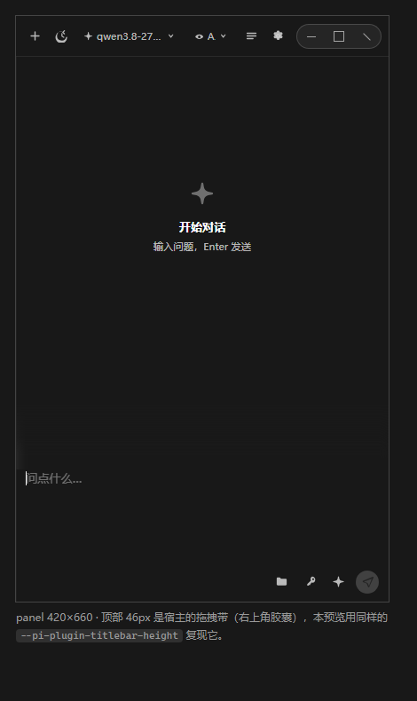
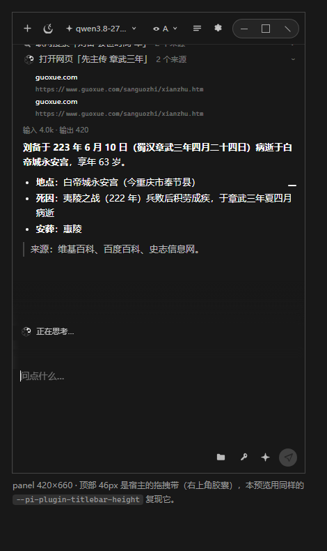
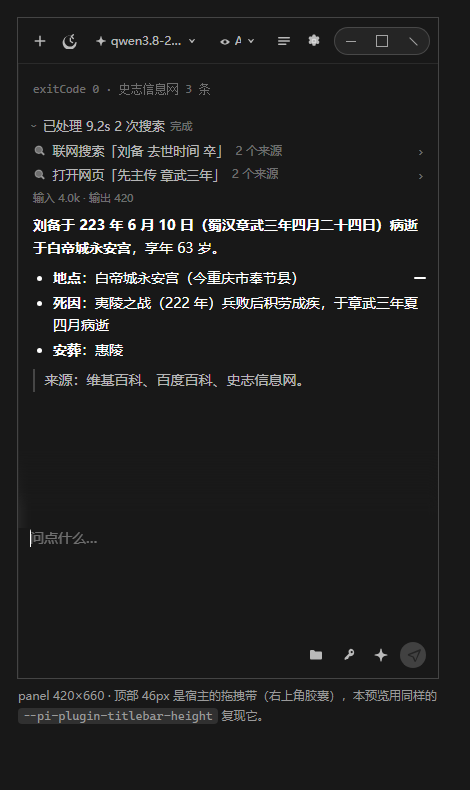

# summon-4-pi

给 [PI-Desktop](https://github.com/vastsa/PI-Desktop) 做的插件集。本仓库只在本地开发，尚未建 GitHub 远程。

**当前状态**

| 插件 | 状态 |
|---|---|
| `local.summon-widget` | ✅ 悬浮圆球 + 系统级快捷键（`Alt+Shift+S`）。可拖动、可缩放、置顶 |
| `local.summon-chat` | ✅ **鲸唤 Summon** 对话浮窗（`Alt+Shift+C`）：Agent 模式（真会话）+ 快捷对话（含联网搜索）、角色预设、Markdown、外观/字号/透明度、**处理过程时间线**（工具调用 / 搜索关键词 / 来源网址 / 用时 / 用量） |

<p>



</p>

> **窗口形态的取舍**：宿主在**创建窗口时**按 manifest 决定窗口标志，且不给插件任何 window
> primitive，所以运行时改不了。`local.summon-chat` 现在取 **panel**
> （`resizable: request.resizable ?? !widget`）：**呼出即拿到键盘焦点、可直接打字**，可缩放；
> 代价是**不置顶**（`alwaysOnTop: widget && …`，置顶只有 widget 能拿到，
> 而 widget 呼出时宿主不给焦点 —— 那正是「按了快捷键却感觉没反应」的主因）。
> 圆球插件不受影响，它仍是可置顶的 widget。

> **逐字显示 ≠ 流式**：宿主给插件的三条路（`agent.complete` / `session/get` / 事件）都
> **没有**回答文本的增量通道，所以「一个字一个字出现」是表现层效果；真正边跑边出现的是
> **过程**（工具调用 / 搜索关键词 / 来源网址 / 用时，这些字段宿主一直是齐的）。
> 证据逐条列在 [`docs/chat-widget-architecture.md`](docs/chat-widget-architecture.md) §3.1。

## 与 PI-Desktop 主软件的统一

`local.summon-chat` 的界面**结构**移植自随包的设计系统（见下），但**配色不再是原型的鲸蓝**：
Token 名照旧，值换成主软件自己的 `apps/desktop/src/styles/tokens.css`
（灰阶 `#181818 / #212121 / #303030`、中性强调色、白 alpha 文字阶梯、`--font-sans`、
4/6/8/14px 圆角）。默认「跟随主软件」：`pi.app.getAppearance()` 取快照、
`appearance:changed` 事件实时跟随主题与语言。

快捷键手感见 [`plugins/local.summon-chat/README.md`](plugins/local.summon-chat/README.md)
的「快捷键」一节：panel 形态拿焦点、可见性由页面如实上报（不再用心跳时长猜）、
manifest 不再重复声明快捷键、录制器产出宿主认的语法。

## 界面设计来源

`local.summon-chat` 的界面**结构**按随包提供的设计系统 **「鲸唤 Summon 原型源码包 v1.4」** 实现，
**颜色/字体/圆角**换成 PI-Desktop 自己的设计 Token（见上）：

- 源包位置：`鲸唤 Summon 原型源码包 v1.4/`（`design.md` 规范 + `index.html` 可交互原型）
- 复用范围：设计 Token **名**（原型 `index.html:7–113`）、内联 SVG 图标 sprite（`115–161`）、
  通用组件与桌面窗口框架 CSS（`168–489`）、视图结构（`684–840`）
- 精简后的规范：`docs/design-spec.md`
- 值来自主软件：`PI-Desktop-src/apps/desktop/src/styles/tokens.css`

## 结论：没有现成插件

调研了插件中心全部 **31 个已发布插件**：**没有任何一个**声明 `keyboard.globalShortcut` 权限，
也没有悬浮窗类插件。唯一沾边的是 `io.github.catdford.color-picker`，它自己写着
「系统级快捷键会随后续版本加入」。但宿主能力已经齐全，所以这属于「有地基、无人盖房」。

详见 [`docs/plugin-plan.md`](docs/plugin-plan.md) §0。

## 仓库结构

```
summon-4-pi/
├── plugins/
│   ├── local.summon-widget/       ← 悬浮圆球（加载开发插件时选这一层）
│   └── local.summon-chat/         ← 鲸唤 Summon 对话浮窗（panel：呼出即可打字）
│       ├── renderer/index.html    ←   对话窗口（结构来自设计系统，配色来自主软件；**构建产物**）
│       ├── renderer/renderer.template.html ← 手写的界面源文件（改界面改这个）
│       └── views/roles.html       ←   角色编辑器（工作面板视图）
├── 鲸唤 Summon 原型源码包 v1.4/   ← 设计系统与可交互原型（设计来源）
├── tools/
│   ├── smoke-test.mjs             ← 圆球：假宿主跑真实 main.js（54 项断言）
│   ├── smoke-chat.mjs             ← 对话窗：假宿主跑真实 main.js（含 transcript 富字段与实时时间线）
│   ├── lint-html-scripts.mjs      ← 界面内联脚本语法 + 叠加层 hidden 检查
│   ├── check-vendor-effects.mjs   ← 第三方动效：在假 DOM 上真的跑一遍（形变插值 / 曲线加载器）
│   ├── fetch-morphicons.mjs       ← 拉取并拼装 docs/vendor/morphicons.js
│   ├── fetch-curve-loader.mjs     ← 拉取并拼装 docs/vendor/curve-loader.js
│   ├── export-design-base.mjs     ← 从设计源包导出 Token/组件 CSS + 图标 sprite（剔除文档页规则）
│   ├── build-renderer.mjs         ← 拼装 renderer/index.html（--check 校验产物是否过期）
│   ├── check-design-port.mjs      ← 移植保真：Token 名覆盖、无自造 Token、sprite、bridge 通道、离线、拖动根元素、拖拽带只占位一次
│   ├── inspect-renderer-tokens.mjs← 解析产物 CSS 的层叠：打印 #win 最终盒模型 + 实际生效的暗色调色板
│   ├── preview-panel.mjs          ← 生成 420×660 + 46px 宿主拖拽带的离线预览页（dark / light / set / transcript）
│   ├── inspect-panel-layout.mjs   ← 用系统 Edge 无头模式量预览页：盒模型、溢出节点、前几行的计算样式
│   ├── measure-layout.mjs         ← 用真实浏览器引擎量产物页：顶栏是否在拖拽带里、控件是否点得到
│   ├── validate-manifest.mjs      ← 用 PI-Desktop 真实 SDK 校验 manifest
│   ├── check-plugin.mjs           ← 跑真实的 pi-plugin check
│   ├── pack-plugin.mjs            ← 跑真实的 pi-plugin pack，产出 .piplug
│   ├── verify-artifact.mjs        ← 确认是 store-only ZIP（防普通 zip 重打）
│   └── ts-js-resolver.mjs         ← 让 Node 直接跑 devkit 的 TS 源码
├── dist/                          ← 打包产物（.gitignore）
├── docs/
│   ├── plugin-plan.md             ← 圆球计划（Phase 0–5）
│   ├── chat-widget-architecture.md ← 对话窗架构、证据出处、硬限制、阶段表
│   ├── api-findings.md            ← Host API 定点调研（Q1–Q5）
│   ├── vendor/                    ← 第三方动效源码 + 生成脚本说明（morphicons / math-curve-loaders）
│   └── preview/                   ← 面板外观预览（由 npm run preview + 无头 Edge 生成）
└── README.md
```

采用官方插件市场的 `plugins/<id>/` 布局，这样 `docs/` 和 `tools/` 不会被卷进 `.piplug`。

## 两个插件为什么要分开

宿主**不给插件任何 window primitive**（ADR 0081/0092/0093 反复写明 `pluginBridge`
"does not gain window primitives"），窗口的形状和尺寸只能写死在 manifest 里，
运行时改不了。所以「圆球 / 对话窗」只能是两个插件，而不是一个插件里的一个开关。

两个插件的默认快捷键刻意错开（`Alt+Shift+S` / `Alt+Shift+C`），可以同时装。

## 快速开始

```bash
npm test        # 两个插件的 smoke test（假宿主跑真实 main.js）
npm run test:vendor # 第三方动效在假 DOM 上真的跑一遍（形变插值 / 曲线加载器）
npm run lint    # 界面内联脚本语法检查
npm run check   # 两个插件都跑真实的 pi-plugin check
npm run pack    # 产出两个 .piplug 到 dist/
npm run verify  # test + test:vendor + lint + renderer:check + design + check

npm run tokens  # 排查用：打印 #win 最终盒模型与暗色实际生效的调色板
npm run preview # 排查用：生成 420×660 + 46px 拖拽带的离线预览页
                #   npm run preview -- light / set / transcript / turn
npm run vendor  # 重新拉取并拼装 docs/vendor/ 下的第三方动效（改版本号时跑）
```

预览页配 `tools/inspect-panel-layout.mjs` 就是一套「离线看界面」的流程：生成页面 →
无头 Edge 截图或量盒模型。`docs/preview/` 里三张图就是这么来的：空状态、
「处理过程」时间线（`transcript-dark.png`）、以及**边跑边出现**的那条路径（`turn-dark.png`）。

单插件：`npm run test:chat`、`npm run check:chat` 等。

在 PI-Desktop 里：插件页 → 溢出菜单 → **加载开发插件** → 选 `plugins/<id>`。

> ⚠️ 加了新权限后**必须重新加载目录**，热重载不覆盖权限变更。

## 第三方动效（vendored）

界面里有两段上游代码，都在 `docs/vendor/`，都由脚本生成（**不要手改**）：

| 文件 | 上游 | 用在哪 | 生成 |
|---|---|---|---|
| `morphicons.js` | [guillermolg00/morphicons](https://github.com/guillermolg00/morphicons)（MIT） | 发送键的 **Send↔Stop 形变** | `npm run vendor:morphicons` |
| `curve-loader.js` | [Paidax01/math-curve-loaders](https://github.com/Paidax01/math-curve-loaders)（MIT） | 「正在思考 / 正在搜索」的**曲线粒子加载动效** | `npm run vendor:curve` |

插件面板必须是**单个自包含 HTML**（宿主只发一个 sandboxed 页面，没有别的资源通道），
所以第三方代码只能由 `tools/build-renderer.mjs` 在 `__VENDOR_JS__` 处内联进去。
`npm run vendor` 会重新下载、重新拼装；`npm run test:vendor` 在假 DOM 上把两段代码
真的跑一遍（形变确实在插值、曲线加载器确实建出 SVG 并在动）——
详见 [`docs/vendor/README.md`](docs/vendor/README.md)。

## 路线 B（仓库 CLI）—— 已达成，且绕开了 `pnpm install`

`packages/plugin-devkit/src/check.ts` 与 `pack.ts` 的整个依赖图只有 Node 内置模块
加上同仓的 `packages/plugin-sdk` 源码，SDK 本身没有运行时依赖。于是
`tools/ts-js-resolver.mjs` 做两件事就够了：

1. TS 源码写 `./walk.js` 而磁盘上是 `walk.ts` → 解析失败时回退到 `.ts`
2. `@pi-desktop/plugin-sdk` 这个 workspace 裸名 → 映射到 `packages/plugin-sdk/src/index.ts`

结果是**真实的** `check()` / `pack()` 逻辑直接跑起来了，省掉了几 GB 的 `node_modules`。

源码检出：`D:\Code\Working-on-it\PI-Desktop-src`（`git clone --depth 1` 自 gitcode 镜像）。
可用 `PI_DESKTOP_SRC` 环境变量覆盖。

## 环境上的两个坑（本机特有）

1. **`hosts` 把 GitHub 全解析到 `127.0.0.1`**（`github.com` / `raw.githubusercontent.com` /
   `api.github.com` 等）。`git clone`、`gh`、`web_fetch` 全部到不了 GitHub。可用镜像：
   - 原始文件：`https://ghfast.top/https://raw.githubusercontent.com/<owner>/<repo>/main/<path>`
   - 备用 CDN：`https://cdn.jsdelivr.net/gh/<owner>/<repo>@main/<path>`
   - 仓库镜像（可 `git clone`）：`https://gitcode.com/GitHub_Trending/pid/PI-Desktop.git`
2. **沙箱内 shell 完全没有 TLS**：TCP 能连上 443，但握手一律
   `schannel: AcquireCredentialsHandle failed: SEC_E_NO_CREDENTIALS`。
   沙箱外一切正常。任何需要联网的命令都要在**完全权限**下跑。
